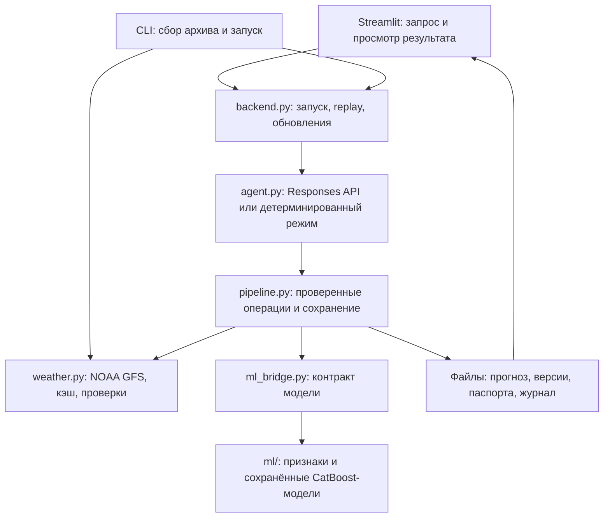

# WindOps AI

**Почасовой прогноз мощности ветроэлектростанции с проверкой происхождения данных.**

Проект команды для HackAlem AI помогает диспетчеру и аналитику ВЭС работать с прогнозами двух турбин на 24–48 часов: видеть ожидаемую нормализованную мощность, погодные входы, историю выпусков и изменения после обновления погоды. Кейс предусматривает воспроизведение исторических запусков на февраль 2026 года.

> **Текущее состояние:** реализованы интерфейс, архив NOAA GFS, backend и ML-плагин `windops.ml.plugin`. В репозитории сохранены январский backtest, февральские прогнозы и отчёт участника №1 о сквозной проверке. **Веса, паспорта и контрольные суммы в `models/` включены в актуальную версию Git**; новый расчёт использует готовые артефакты после установки зависимостей и настройки плагина. Живой вызов OpenAI пока не проверен.

## Что реализовано

- **Интерфейс на русском языке:** выбор одной или двух турбин, даты выпуска и горизонта; графики, почасовые таблицы, история выпусков, паспорт данных и журнал событий.
- **Архивная погода:** загрузка выбранных полей оригинальных GFS, извлечение двух площадок, возобновляемый файловый кэш и CSV для обучения модели.
- **Проверки входов и результата:** историческая доступность погоды, полнота часовой сетки, контрольные суммы, совместимость ML-модели, допустимый cutoff обучения и диапазон мощности 0–1.
- **Управление расчётом:** один агент через OpenAI Responses API со строгими схемами инструментов; отдельный детерминированный режим и явно обозначенный резервный режим.
- **Replay и версии:** последовательные исторические запуски, обнаружение нового допустимого погодного цикла, пересчёт и сохранение связи с предыдущим прогнозом. Эти сценарии мощности используют ML-плагин и требуют сохранённых весов моделей.
- **Проверка качества:** загрузка январского backtest в интерфейс, расчёт MAE/RMSE и сравнение с baseline на совпадающих парах. Реальный артефакт — `data/ml/january_backtest.json`.
- **Экспорт:** CSV выпуска, JSON-паспорт, очищенный журнал и выгрузки replay. Итоговый экспорт проходит дополнительные проверки; синтетические и самостоятельно загруженные непроверенные данные не получают права итоговой выгрузки.

## Как работает решение

Основной пользовательский сценарий при наличии сохранённых моделей:

1. Пользователь выбирает турбины, исторический момент запуска и 24 либо 48 часов.
2. Backend получает подходящий GFS-выпуск из архива или кэша и проверяет доступность каждого целевого часа на момент запуска.
3. ML-модуль подготавливает признаки и рассчитывает нормализованную мощность. Его версия и обучающий cutoff проверяются перед вызовом.
4. Backend проверяет результат, вычисляет агрегаты, сохраняет прогноз, паспорта и журнал.
5. Интерфейс показывает график, таблицу и происхождение данных; проверенный результат доступен для экспорта.
6. Проверка обновлений при обнаружении нового допустимого цикла запускает новый расчёт. Старый выпуск сохраняется, сравнение проводится по общим целевым часам.

**Для нового расчёта задайте `WINDOPS_ML_MODULE=windops.ml.plugin`; папка `models/` уже присутствует в репозитории.** Без настройки возникает `MODEL_NOT_CONFIGURED`, без подходящих весов — `ML_MODEL_MISSING`. Просмотр сохранённых результатов, погодный сборщик и тест интерфейса доступны независимо от весов.

## Технологии

Версии зафиксированы в `requirements*.txt`:

- **Python** — backend, подготовка данных и проверки. Погодный backend проверен на Python 3.12 / Linux; сохранённые результаты обучения участника №1 получены на Python 3.14.7 / Linux.
- **Streamlit 1.64.0** — веб-интерфейс.
- **Plotly 6.9.0** — интерактивные графики.
- **pandas 2.3.3, NumPy 2.3.5, tzdata 2026.4** — таблицы, вычисления и часовые пояса.
- **requests 2.34.2, ecCodes 2.48.0** — выборочные HTTP Range-запросы и чтение GRIB2.
- **CatBoost 1.2.10** — отдельные CPU-модели мощности двух турбин; дополнительно реализованы постоянный и ветровой baseline.
- **OpenAI Python SDK 3.19.0, Responses API** — управляющий LLM-цикл. Конкретная LLM задаётся через `OPENAI_MODEL`; фиксированной модели по умолчанию нет.
- **jsonschema 4.26.0** — проверка аргументов инструментов.
- **pytest 9.1.1, Streamlit AppTest** — автоматические проверки; для дополнительной браузерной приёмки предусмотрены Playwright и Chromium.
- **NOAA GFS 0,25° в публичном S3-архиве** — внешние прогнозы погоды.

LLM управляет вызовами инструментов; численные прогнозы возвращает отдельный ML-модуль. Январские проверочные модели и финальные февральские модели имеют разные cutoff и версии.

## Архитектура

Приложение состоит из Python-модулей в одном проекте; результаты хранятся в файлах.



Агенту доступны шесть инструментов: `list_weather_candidates`, `fetch_weather`, `validate_weather`, `predict_power`, `analyse_forecast`, `publish_forecast`. В коде ограничены число итераций и набор допустимых аргументов. Проверки повторяются внутри операций прогнозирования и сохранения, поэтому отдельный пропуск `validate_weather` не отменяет контроль данных.

```text
app.py                         Интерфейс и пользовательские действия
src/windops/
  core.py                      Время, координаты, ошибки, контрольные суммы
  weather.py                   Загрузка, извлечение точек и проверка GFS
  cli.py                       Аудит CSV, сбор архива, запуск из терминала
  ml_bridge.py                 Подключение и проверка ML-модуля
  ml/                          Подготовка SCADA, обучение, backtest, плагин
  pipeline.py                  Расчётный процесс, сохранение, сравнение
  agent.py                     Строгие инструменты и цикл Responses API
  backend.py                   run_forecast, run_replay, check_updates
  ui/                          Графики, состояние, контракты и экспорт
tests/                         Тесты backend и интерфейса
scripts/browser_acceptance.py   Дополнительная браузерная приёмка
docs/                          Контракты, сценарии и подробные инструкции
data/                          Исходные CSV, погодный кэш и отчёты
```

## Установка и запуск

### 1. Подготовить окружение

Получите репозиторий команды и откройте терминал в его корне. Для установки зависимостей нужен интернет. Для воспроизведения исходного ML-обучения используйте Python 3.14.7: сохранённый выбор параметров проверяет точные версии окружения. Вариант с `uv`:

```bash
uv venv --python 3.14.7 .venv
uv pip install --python .venv/bin/python -r requirements-dev.txt -r requirements-ml.txt
export PYTHONPATH=src
```

Если окружение уже создано, повторять его создание не требуется. Альтернатива без `uv`, при установленном Python 3.14.7:

```bash
python3.14 -m venv .venv
.venv/bin/python -m pip install -r requirements-dev.txt -r requirements-ml.txt
export PYTHONPATH=src
```

Для PowerShell:

```powershell
py -3.14 -m venv .venv
.\.venv\Scripts\python.exe -m pip install -r requirements-dev.txt -r requirements-ml.txt
$env:PYTHONPATH = "src"
.\.venv\Scripts\python.exe -m streamlit run app.py
```

Дальнейшие команды приведены для Linux. В Windows используйте `.venv\Scripts\python.exe` и синтаксис `$env:ИМЯ = "значение"` для переменных. Текущий полный backend проверен на Linux.

`requirements-dev.txt` устанавливает UI, backend и pytest; `requirements-ml.txt` добавляет CatBoost для обучения и inference. Для запуска без тестов установите `requirements-backend.txt` и `requirements-ml.txt`. `requirements-browser.txt` нужен только для дополнительной проверки браузером. Существующее окружение не пересоздавайте без необходимости: для воспроизведения обучения оно должно соответствовать `data/ml/selection.json`.

### 2. Настроить площадки

Создайте `config.local.json` по [config.example.json](config.example.json). Для существующего GFS-backend конфигурация выглядит так:

```json
{
  "timezone": "Asia/Almaty",
  "timestamp_convention": "target_time = issued_at + horizon_step hours",
  "normalization": "0_1",
  "default_origin": "2026-01-31T23:00:00+05:00",
  "sites": [
    {"site_id": "turbine_1"},
    {"site_id": "turbine_2"}
  ]
}
```

На подготовленном рабочем месте команды этот файл уже существует. В Git он не включён. Без него доступен тест интерфейса на синтетике, но форма реального расчёта требует заполненных настроек.

### 3. Открыть интерфейс

```bash
.venv/bin/python -m streamlit run app.py
```

Откройте [локальное приложение](http://localhost:8501). Для просмотра синтетического примера после установки зависимостей не нужны исходные датасеты, ML-модель, OpenAI-ключ или доступ к NOAA.

### 4. Переменные окружения

Шаблон имён — [.env.example](.env.example). **Файл `.env` автоматически не читается**: задавайте значения в окружении процесса.

- `WINDOPS_CONFIG` — JSON-конфигурация интерфейса; по умолчанию `config.local.json`.
- `WINDOPS_BACKEND_MODULE` — необязательная замена backend; приложение использует `windops.backend`.
- `WINDOPS_DATA_DIR` — каталог backend-данных; по умолчанию `data/` в корне репозитория.
- `WINDOPS_ML_MODULE=windops.ml.plugin` — реализованный ML-плагин.
- `WINDOPS_MODEL_DIR` — необязательный каталог сохранённых моделей; по умолчанию `models/`.
- `WINDOPS_EXECUTION_MODE` — `deterministic`, `agent` или `auto`.
- `WINDOPS_OFFLINE=1` — запрет погодных сетевых запросов при запуске прогнозов через backend. Для команд `weather` и `collect` используйте флаг `--offline`.
- `OPENAI_API_KEY`, `OPENAI_MODEL` — ключ проекта и идентификатор доступной ему модели для режима `agent`.
- `WINDOPS_SMOKE_BUNDLE` — путь к настоящему сохранённому прогнозу для дополнительного интеграционного теста.

В режиме `deterministic` LLM не вызывается. `auto` при отсутствии ключа или ошибке LLM может перейти в явно обозначенный `deterministic_fallback`; этот режим всё равно требует настоящую ML-модель. Наличие ключа при незаданном `OPENAI_MODEL` является ошибкой конфигурации.

ML-модуль должен предоставлять `get_model_metadata(site_id, forecast_origin)` и `predict_power(site_id, weather_rows, model_version)`. Точные требования — в [контракте backend](docs/BACKEND.md#контракт-ml-модуля).

## Как проверить решение жюри

### Сценарий А: интерфейс без внешних сервисов

1. Запустите приложение и включите **«Тест интерфейса · синтетика»** в боковой панели.
2. Выберите обе турбины, горизонт 48 часов и нажмите **«Загрузить тестовый выпуск»**.
3. Откройте график, почасовую таблицу и вкладку **«Агент и данные»**. Посмотрите паспорт и диагностическую выгрузку.
4. Убедитесь, что данные помечены как тестовые, а итоговый экспорт заблокирован. Тестовая зона времени — UTC; реальные площадки используют `Asia/Almaty`.

Этот сценарий проверяет интерфейс и его ограничения; качество ML и реальные действия LLM он не демонстрирует.

### Сценарий Б: настоящая архивная погода

В отдельном терминале из корня проекта:

```bash
export PYTHONPATH=src
.venv/bin/python -m windops.cli weather --origin 2026-01-31T23:00:00+05:00 --horizon 48
.venv/bin/python -m windops.cli weather --origin 2026-01-31T23:00:00+05:00 --horizon 48 --offline
```

Первый вызов использует проверенный кэш или скачивает данные NOAA; без кэша необходим интернет. Ожидаются **96 строк: две турбины × 48 часов**, версия погоды и метаданные доступности. Повтор без сети должен использовать тот же `weather_version`. Набор сохраняется в `data/weather/bundles/`.

Проверка запрета будущего погодного выпуска:

```bash
.venv/bin/python -m windops.cli weather --origin 2026-01-31T23:00:00+05:00 --run 2026-02-01T00:00:00Z --offline
```

Ожидается ошибка **`FUTURE_WEATHER` и ненулевой код завершения**: выбранный цикл инициализирован после исторического запуска. Это ожидаемый результат проверки.

### Сценарий В: реальные сохранённые результаты и новый расчёт

Уже доступны без повторного обучения:

- `data/ml/january_backtest.json` — загрузите его на вкладке **«Проверка качества»** и нажмите **«Проверить артефакт»**;
- `data/ml/february_hourly.csv` — 1 344 уникальные строки, по одной на местный час февраля и турбину;
- `data/ml/february_full_releases.csv` — 2 784 строки всех 58 исходных 48-часовых выпусков, включая март;
- `data/ml/run_summary.json` — версии, объёмы обучения, метрики и ограничения.

Для **нового расчёта** используйте включённую в репозиторий папку `models/`: веса, паспорта и контрольные суммы находятся в `models/<site_id>/<model_version>/`. Повторное обучение для запуска не требуется. Команды воспроизводимого обучения — в [docs/ML.md](docs/ML.md); они требуют указанного там окружения. Не редактируйте зафиксированный выбор параметров ради обхода проверки версий.

```bash
export PYTHONPATH=src
export WINDOPS_ML_MODULE=windops.ml.plugin
export WINDOPS_EXECUTION_MODE=deterministic
export WINDOPS_OFFLINE=1
.venv/bin/python -m windops.cli forecast --site turbine_1 --origin 2026-01-31T23:00:00+05:00 --horizon 48
.venv/bin/python -m streamlit run app.py
```

При успешном расчёте backend возвращает `forecast_id` и сохраняет `bundle.json`, `forecast.csv`, паспорта, контрольную сумму, отчёт проверки и `events.jsonl` в `data/forecasts/<forecast_id>/`.

Для повторного исторического replay при наличии весов:

```bash
.venv/bin/python -m windops.cli replay --start 2026-01-31 --end 2026-02-28
.venv/bin/python -m windops.ml.cli export-february
```

Даты означают местные даты выпусков в 23:00, включительно. Полные 48-часовые выпуски сохраняют часы марта. ML-выгрузка на февраль использует фиксированное правило: для дня D берутся шаги 1–24 исходного выпуска D−1 в 23:00. Внутридневные обновления в эту таблицу не включаются.

Для проверки обновления используйте `check-updates <реальный_forecast_id> --as-of 2026-02-01T06:00:00Z` для первого выпуска от 31 января. Без явного `as_of` UI сдвигает виртуальный момент на 12 часов.

Для LLM-сценария дополнительно задайте `OPENAI_API_KEY`, `OPENAI_MODEL` и `WINDOPS_EXECUTION_MODE=agent`. Настоящий вызов API в сохранённом отчёте приёмки не проверен.

### Результаты январской проверки

По сохранённым `data/ml/run_summary.json` и `data/ml/january_backtest.json`, на одинаковых 1 464 прогнозных парах каждой турбины:

- **Турбина 1:** CatBoost MAE **0,215566**, RMSE **0,299051**; ветровой baseline MAE 0,239332, RMSE 0,332403. Улучшение MAE — **9,93%**.
- **Турбина 2:** CatBoost MAE **0,220588**, RMSE **0,306425**; ветровой baseline MAE 0,245854, RMSE 0,341828. Улучшение MAE — **10,28%**.

Это ошибки в шкале нормализованной мощности 0–1. Они относятся к отдельным январским проверочным моделям, не к финальным моделям после переобучения на январе. Разбивка по горизонтам и сравнение с постоянным baseline — в [docs/ML.md](docs/ML.md). Февральских метрик нет: фактическая мощность не предоставлена.

Выбраны CatBoost depth=4, 93 дерева для `turbine_1` и 92 для `turbine_2`. Финальное обучение использовало 5 754 / 5 742 прогнозные пары, или 2 889 / 2 883 уникальных целевых часа. Январский cutoff — 31.12.2025 22:00 +05:00, финальный — 31.01.2026 22:00 +05:00.

### Автоматические проверки

```bash
.venv/bin/python -m pytest -q
.venv/bin/python -m compileall -q app.py src
uv pip check --python .venv/bin/python
```

При установке через pip вместо последней команды используйте `.venv/bin/python -m pip check`.

Участник №1 сохранил отчёт о **162 пройденных тестах без пропусков** на своём рабочем месте с весами моделей. Для полного повторения нужны `WINDOPS_RUN_REAL_ML_TEST=1` и `WINDOPS_SMOKE_BUNDLE`, указывающий на существующий локальный `bundle.json`. Абсолютные пути в перенесённых отчётах относятся к компьютеру автора: используйте путь внутри своего checkout. Без весов реальная ML-проверка пропускается; без необходимых погодных файлов пропускаются и тесты локального GFS. В модульных тестах OpenAI заменяется тестовым клиентом.

Подробная демонстрация и дополнительная приёмка Chromium описаны в [docs/DEMO.md](docs/DEMO.md). Тесты не являются доказательством точности прогноза мощности.

## Данные и интеграции

### Наблюдения турбин

Локальные `data/scada/turbine_1.csv` и `turbine_2.csv` — неизменённые копии файлов организаторов. Они содержат 10-минутные измерения с марта 2023 года по 31 января 2026 года: ветер, температуру и нормализованную мощность. В исходных временных рядах есть пропуски; аудит доступен через:

```bash
.venv/bin/python -m windops.cli audit
```

Команда требует обеих локальных CSV-копий и сохраняет `data/reports/scada_audit.json`. Мощность имеет шкалу 0–1; единицы ветра — м/с, температуры — °C. Фактических значений мощности февраля нет.

### Погода NOAA GFS

Загрузчик обращается к `https://noaa-gfs-bdp-pds.s3.amazonaws.com` по HTTPS без AWS-ключа. Он читает индексы и выбранные GRIB2-сообщения температуры на 2 м и компонент ветра на 10/100 м, затем извлекает точки:

- `turbine_1`: 43.645150, 78.535604;
- `turbine_2`: 43.643198, 78.538828.

Обе площадки используют ближайший узел GFS 43.75, 78.5, примерно в 12 км от турбин. Ветер на 100 м не объявляется ветром на высоте ступицы.

Исторический допуск требует `run_initialized_at <= availability_upper_bound <= forecast_origin` для каждого целевого часа. Верхняя граница берётся из `Last-Modified` оригинального объекта S3: она относится к **данной версии объекта**, а не к точному первоначальному времени публикации NOAA. Время сегодняшнего скачивания хранится отдельно. Контролируются HTTP 206, диапазоны байтов, ETag и SHA-256.

Внутри backend используется UTC, в реальном интерфейсе — `Asia/Almaty`. Для 2025–2026 годов местные 23:00 соответствуют 18:00 UTC. Ежедневный сбор использует цикл GFS 00 UTC; первый целевой час — через час после пользовательского origin.

**Подтверждённый локальный архив:** 152 ежедневных выпуска с 30.09.2025 по 28.02.2026, по 48 часов для двух турбин, **14 592 строки** в `data/weather/weather_for_ml.csv`. Отчёты `data/reports/weather_coverage.json` и `backend_verification.json` фиксируют покрытие, контрольные суммы и успешную повторную проверку без сети. Это начальный диапазон, а не вся история с 2023 года.

Воспроизводимый сбор полного диапазона:

```bash
.venv/bin/python -m windops.cli collect --start 2025-09-30 --end 2026-02-28 --workers 8
.venv/bin/python -m windops.cli export-weather
```

Полный сбор требует десятков ГБ сетевого трафика; для приёмки достаточно одного выпуска из сценария Б. Кэш сохраняет извлечённые точки и свидетельства, а не полные глобальные сетки. Повторный сбор использует уже загруженные объекты.

Ключ таблицы — `(site_id, forecast_origin, target_time)`. Один целевой час может встречаться в нескольких выпусках с разной заблаговременностью.

### OpenAI и локальное хранение

Управляющий код отправляет в OpenAI параметры запроса, идентификаторы наборов, статусы и агрегаты. Исходные CSV и полные погодные ряды ему не передаются; запросы используют `store=False`. Секреты берутся из окружения.

**В текущей версии подготовленные файлы `data/` уже отслеживаются Git:** в них входят обе исходные CSV-копии, погодный архив и отчёты. При передаче только исходного кода каталог данных нужно предоставить отдельно, а погодный архив можно восстановить загрузчиком.

В актуальной версии `models/` отслеживается Git: сохранены baseline, январские и финальные модели двух турбин. Для `.env`, `config.local.json` и `artifacts/` настроены правила игнорирования; эти локальные файлы не входят в текущий набор отслеживаемых файлов. Подробности backend — в [docs/BACKEND.md](docs/BACKEND.md); фактический состав данных сверяйте с Git, поскольку прежние заметки описывают первоначально локальное хранение.

## Ограничения текущей версии

- **Окружение обучения зафиксировано:** готовые веса включены в Git; для повторения выбора параметров используются точные версии из `data/ml/selection.json`. Для нового прогноза нужны ML-зависимости и настройка `WINDOPS_ML_MODULE`.
- **Живой LLM-сценарий не проверен:** код Responses API и строгих инструментов есть, но ключ и конкретная модель API не настроены.
- **Февральского факта нет:** прогнозы уже сохранены, но их фактическую ошибку по предоставленным CSV вычислить нельзя. Качество внутридневных обновлений отдельно не оценено.
- **Семантика SCADA требует уточнения:** обучение использует явно отмеченные предположения «метка — начало интервала» и «нулевая задержка поступления». Они настраиваются. Время до марта 2024 года отдельно не нормализовано; основной обучающий период начинается в октябре 2025 года.
- **Погода имеет пространственное ограничение:** один узел GFS обслуживает обе турбины; отдельной локальной коррекции погоды пока нет.
- **Обновления запускаются по запросу:** после обнаружения нового допустимого цикла расчёт выполняется автоматически, но постоянно работающего планировщика нет. При отсутствии кэша нужен доступ к NOAA.
- **Синтетика предназначена для проверки интерфейса.** Загруженный JSON также не получает доверие backend только из заявленных внутри него полей.

## Развёрнутая версия

**Подтверждённая публичная ссылка на deployed-версию в репозитории отсутствует.** Доступен локальный запуск по адресу [http://localhost:8501](http://localhost:8501); это адрес на компьютере, где запущен Streamlit.

## Документация

- [ML: обучение, версии, результаты и воспроизведение](docs/ML.md).
- [Backend, архив погоды и контракт ML-модуля](docs/BACKEND.md).
- [Форматы прогнозов, январской проверки и интерфейсная интеграция](docs/INTEGRATION.md).
- [Сценарий демонстрации и браузерная приёмка](docs/DEMO.md).
- [Проверка перед сдачей](docs/SUBMISSION_CHECKLIST.md).
- [Правила разработки](AGENTS.md).
